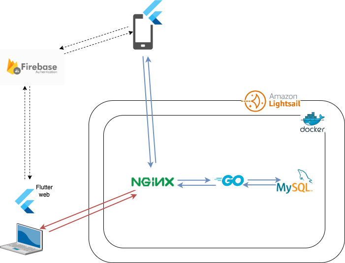

* Suito
** 全体の構成
※ Flutter webは Google Play Storeの「データ削除ポリシー対応」として、[[https://web.suito.wakamenod.com][アカウント削除ページ]]作成に使用

** 試したこと (Flutter)
- ローカライズは[[https://pub.dev/packages/slang][slang]]を使用
- [[https://pub.dev/packages/envied][envied]] で環境変数の取得
- firebase_authを使った認証
  - [[https://pub.dev/packages/firebase_auth][firebase_auth]]
  - [[https://pub.dev/packages/firebase_ui_auth][firebase_auth_ui]]
  - IdTokenを送信して自前のバックエンドで認証
- [[https://pub.dev/packages/riverpod][riverpod]]で状態管理
- [[https://pub.dev/packages/go_router][go_router]]での画面遷移・ルーティング
- Flutter webでアカウント削除ページの作成
- [[https://pub.dev/packages/dio][dio]] をつかったAPI通信
  - モデル部分はopenapiによる自動生成
- unitテスト、widgetテストの導入
  - Goldenテスト導入 ([[https://pub.dev/packages/golden_toolkit][golden_toolkit]])
  - [[https://pub.dev/packages/mocktail][mocktail]] を使用しモックを使ったテストの導入
- フォーム実装およびバリデーションは[[https://pub.dev/packages/formz][formz]]を使用
- サーバーバージョンチェック
  - アプリバージョンと不一致の場合ストアへ遷移
- [[https://pub.dev/packages/syncfusion_flutter_charts][syncfusion_flutter_charts]] によるチャートの実装

** 試したこと (Go)
- Webフレームワークは [[https://github.com/labstack/echo][echo]] を使用
- ORMは [[https://github.com/go-gorm/gorm][gorm]] を使用
- 簡単な3層レイヤーを導入
- [[https://github.com/swaggo/swag][swag]] を使ったSwaggerドキュメント生成
- firebase認証
  - Middlewareでクライアントから送られたIdTokenを認証
- 独自エラー定義
- [[https://github.com/matryer/moq][moq]] を使ったモック生成
- [[https://github.com/go-co-op/gocron][gocron]] による定義処理の実装
-

** TODO
*** TODO アプリUIからサインアウト・プロフィール画面へ遷移できない
=app_router.dart= に =/profile= (=AppRoute.profile=) と =/sign-out= (=AppRoute.signOut=) の
ルートは定義されているが、そこへ遷移するコードがアプリ内に存在しないため、
画面からサインアウトやプロフィール表示ができない。

- firebase_auth を使っていた頃からの既存の欠落（Supabase 移行で持ち込んだものではない）
- サインアウト処理自体は実装・テスト済み
  (=features/authentication/services/auth_controller.dart= の =signOutControllerProvider=)
- 対応案: =shell_screen.dart= のシェル（ボトムナビ）に設定／プロフィールへの導線を追加する

*** TODO 本番 Supabase プロジェクトに認証 deep link のリダイレクト URL を登録する
確認メール・パスワードリセットメールのリンクをアプリへ戻すための設定。
ローカルスタック (=supabase/config.toml= の =additional_redirect_urls=) には
追加済みだが、ホスト環境はダッシュボードからの手動登録が必要。

- Supabase Dashboard > Authentication > URL Configuration > Redirect URLs に
  =net.wakamenod.suito://login-callback/= を追加する
- この値は =mobile/lib/src/features/authentication/auth_redirect.dart= の
  =kAuthRedirectUrl= と一致していること
  (Android は =AndroidManifest.xml= の intent-filter、iOS は =Info.plist= の
  =CFBundleURLTypes= 側も同じ値で設定済み)
- 未登録のままだと GoTrue はリンクの =redirect_to= を Site URL (Web) に
  差し替えるため、メールから戻ってきてもアプリが開かない
- 検証: ローカルでは =mobile/test/src/features/authentication/auth_flow_test.dart= の
  「the reset email links back into the app」が Mailpit のメール本文で確認している
